## Attention in transformers

# Why We Need the Transformer in Deep Learning

Before Transformers, the dominant models for sequential data (like text, audio, DNA, time series) were **RNNs** (Recurrent Neural Networks) and their stronger variants like **LSTMs** and **GRUs**. These models read input step by step, passing information forward in sequence. That had some big **limitations**:

## 🚨 Limitations of RNNs/LSTMs
1. **Poor handling of long-term dependencies**  
   - RNNs struggle to remember information far back in a sequence (like the start of a long paragraph).  
   - Even LSTMs, which improved memory, had practical limits.

2. **Sequential bottleneck**  
   - RNNs and LSTMs process one token at a time, making training slow and less parallelizable.  

3. **Difficulty in capturing context**  
   - RNNs focus more on nearby tokens and can "forget" or distort the importance of words far apart.

---

## 💡 What the Transformer Brings

The **Transformer**, introduced in *"Attention Is All You Need"* (Vaswani et al., 2017), solved these problems with a new idea: **attention**.

- **Self-Attention**  
  Instead of moving step by step, Transformers look at *all tokens in parallel*. Each word can "attend" to every other word directly, no matter how far apart.  
  Example: In *"The cat that the dog chased was black"*, the model can directly connect *"cat"* with *"was black"*.

- **Parallelization**  
  Since Transformers don’t rely on sequential recurrence, we can process all words at once → **much faster training** on GPUs/TPUs.

- **Scalability**  
  Transformers scale extremely well with more data and parameters. This is why models like GPT, BERT, and LLaMA can be trained with billions of parameters.

- **Versatility**  
  They’re not just for text. The same architecture powers **vision transformers (ViT)**, **protein folding (AlphaFold)**, **speech recognition**, and even **reinforcement learning**.

---

- The goal of the transformer model is to predict the next word in a sequence of words.
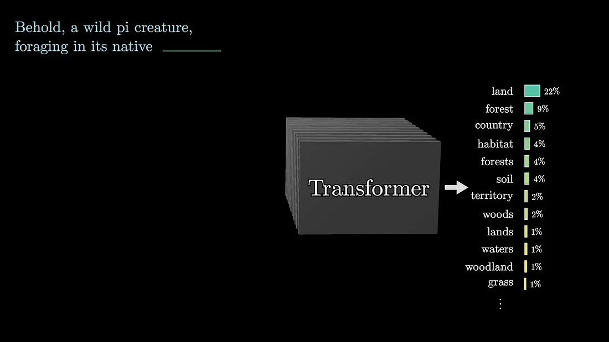

Tokens, which smallest units of text, are associated with high-dimensional vectors called embeddings.
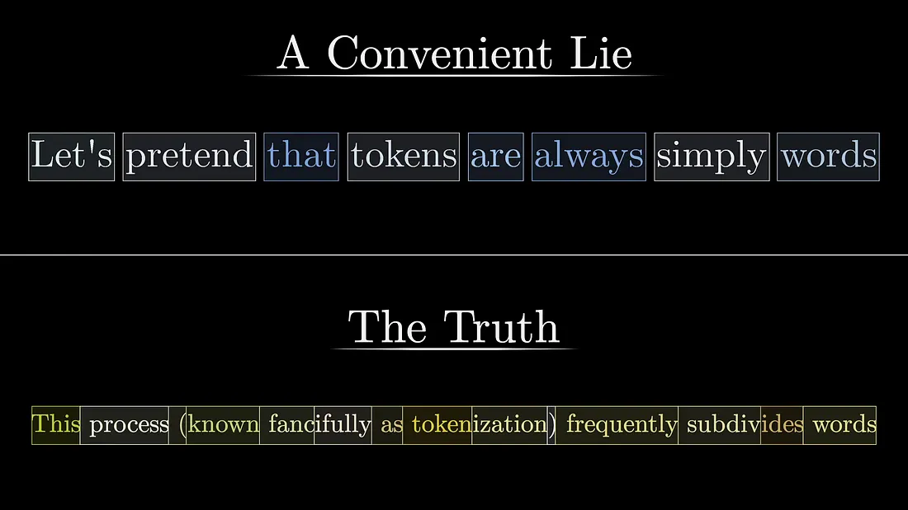

These embeddings capture semantic meaning in a high-dimensional space.
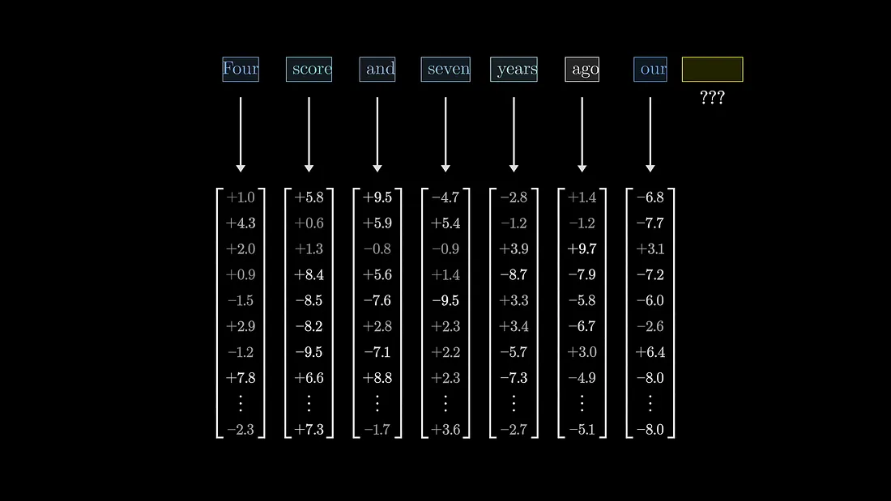

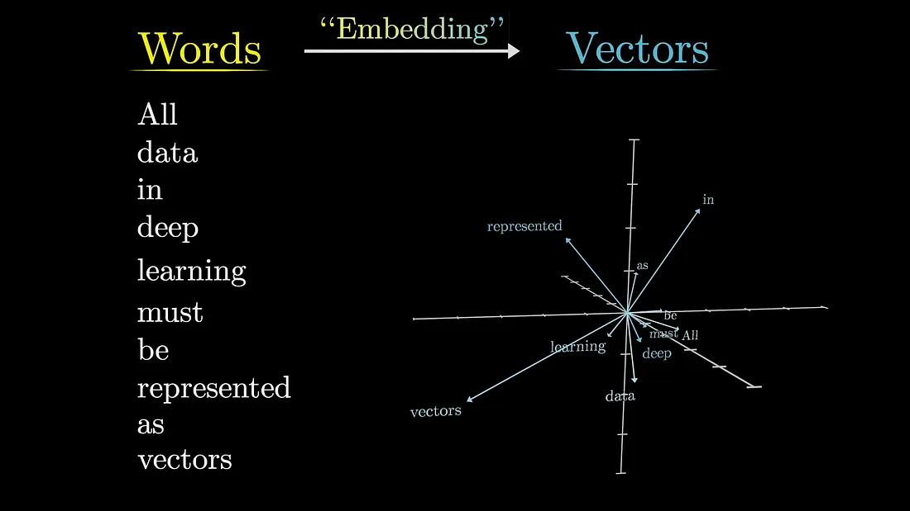

The attention mechanism helps adjust these embeddigs to encode richer contextual meanings of tokens within the input sequence.

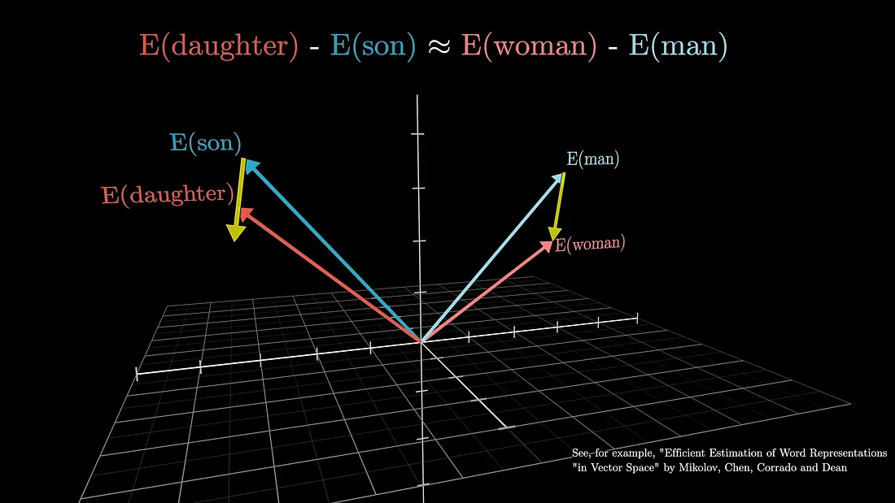

Before diving deep into computational details of the transformer, it's important to consider an example that demonstrates the desired behavoir of attention.

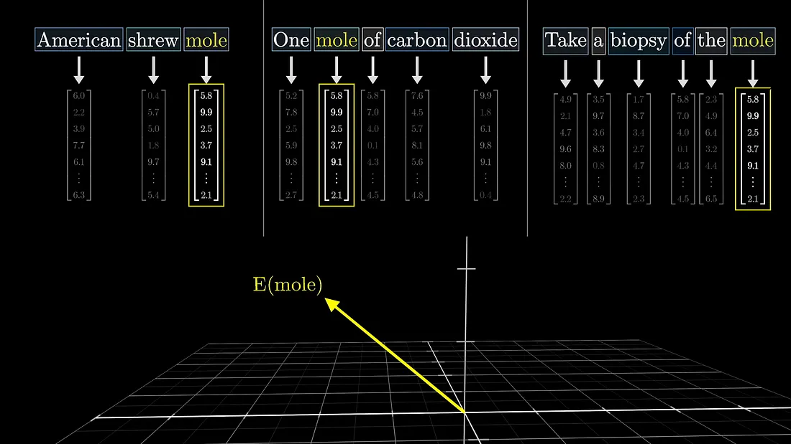

For example the word 'mole' in each sentence in the diagram above, has different meanings in different contexts, but in the initial step of a transformer, the vector embedding associated with the token 'mole' is the same in all cases. It is the next step in which the surrounding embeddings provide contect and influence the specific meaning. The attention block allows the model to refine the meaning of a word and transfer information between embeddings. The prediction of the next token is based on the last vector in the sequence.

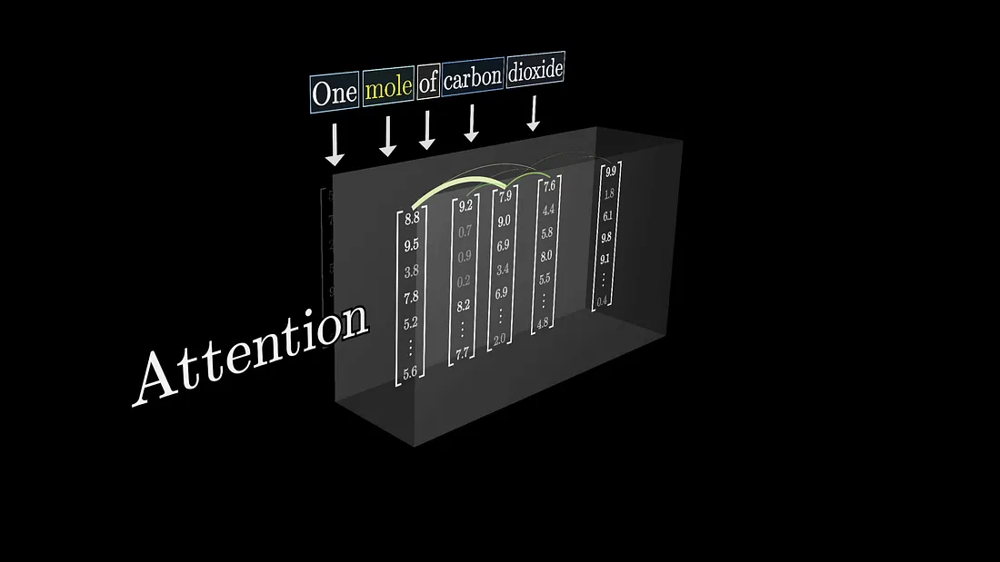

In order for the model to accurately predict the next word, the final vector in the sequence needs to be updated by all of the attention blocks to represent the relevant information from the full context window. Suppose the input is 'a fluffy blue creature roamed the verdant forest' and we only care about adjectives adjusting the meaning of their coresponding nouns. Each word is initially embedded as a high dimensional vector that encodes its meaning and position.

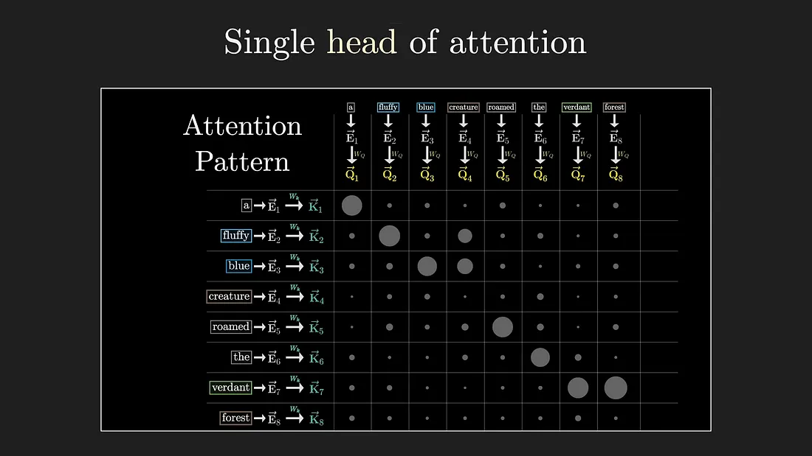

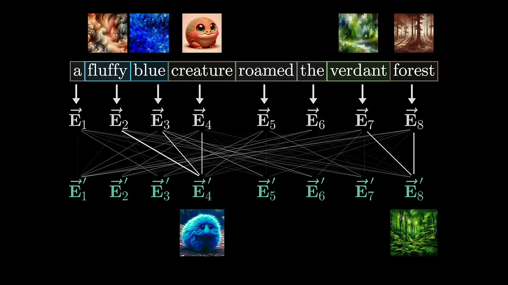

## The Attention Block
In deep learning, word embeddings are used to represent words and their positions in a context. The goal in attention mechanism is to refine the meaning of these embeddings by incorporating meaning from other words. This refining process is achieved through matrix vector multiplications, whre tunable weights are learned based on the data.
This done by computing a query vector for each word, which is obtained by multiplying a learned query matrix with the embeddings of each word.

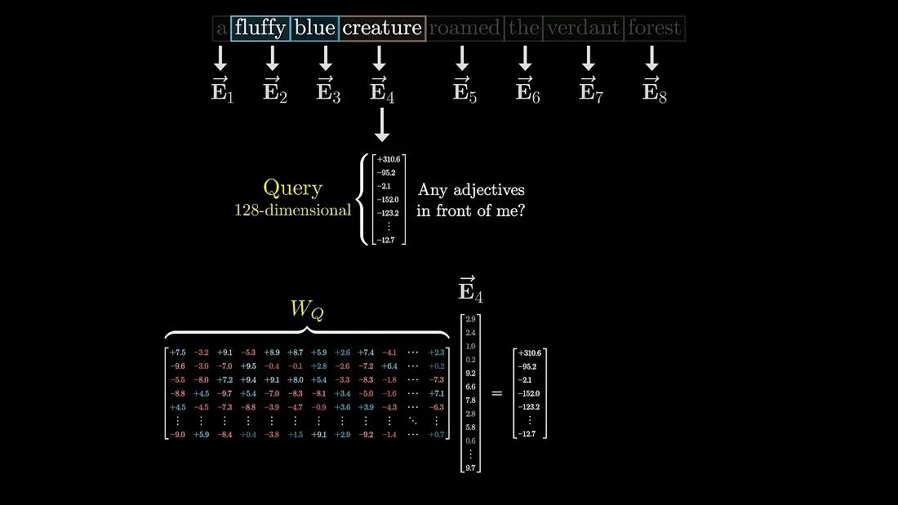

Similarly, a key matrix is multiplied with the embeddings to obtain key vectors. The dot product between the keys and queries measures their alignment, indicationg which embeddigs attend to each other.
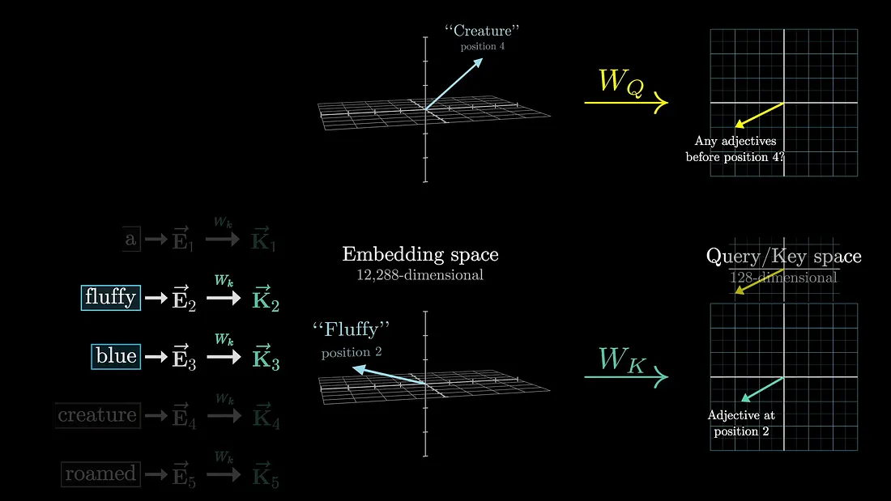

The embeddings of fluffy and blue would attend to the embedding of creature in our example. This process involves tuning a large number of parameters to minimize the cost function.
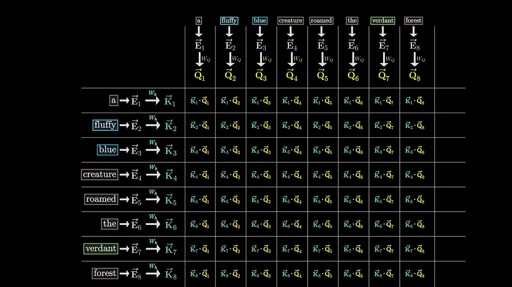

The maginitude of relationships among tokens with each other is also seen.
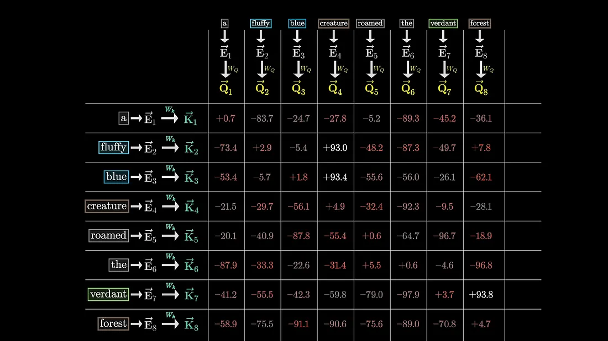

## Deep dive
In the transformer model, we use a grid of values to represent the relevance between words. In the previous diagram we obtained the magnitude of relationships among tokens, but to capture how much attention each token should pay to each other we normalize these magnitudes to obtain attention scores. These scores tells a particular token in the input sequence,how much attention in should pay to the other tokens.

The normalization function we use is the softmax function.
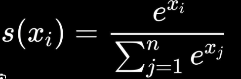

This functions returns a probability distribution of attention scores.

The variables Q and K represent the query and key vectors, and the numerator represents the dot product between the keys and queries. We then divede the values by the square root of the dimension for numerical stability. During trainnig, the model predicts every possible token for efficiency.
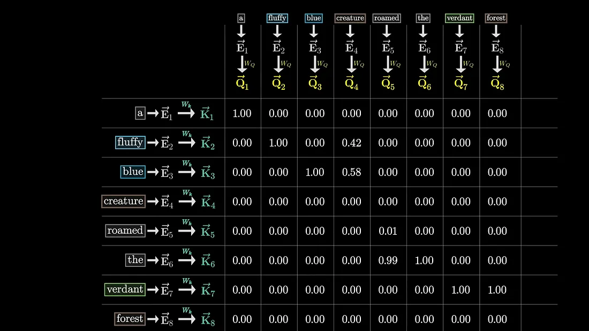

In order to prevent later words from influencing earlier words, we need to ensure that certain spots in the attention pattern are forced to be zero. However, setting them equal to zero would disrupt the normalization of the columns, so we need to find another solution. A suitable solution is to handle certain entries before applying softmax is to set them to negative infinity. This ensures that after applying softmax, those entires becom zero while the column remain normalized. This process is called masked attention, which is widely used in GPT models to prevent later tokens from influencing earlier ones.
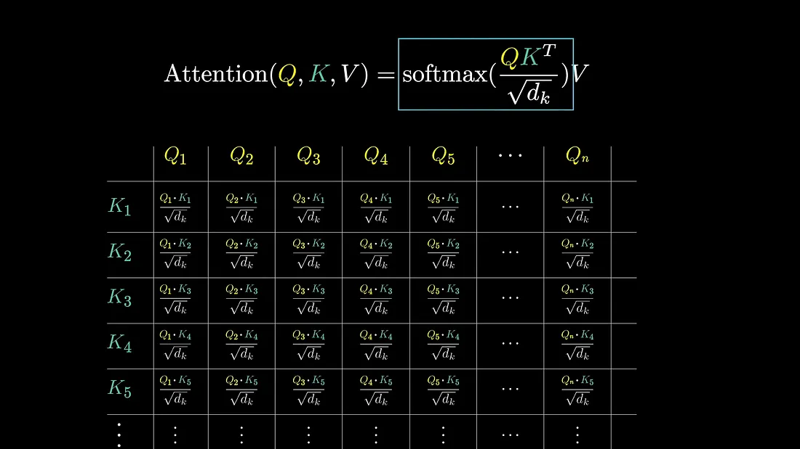

