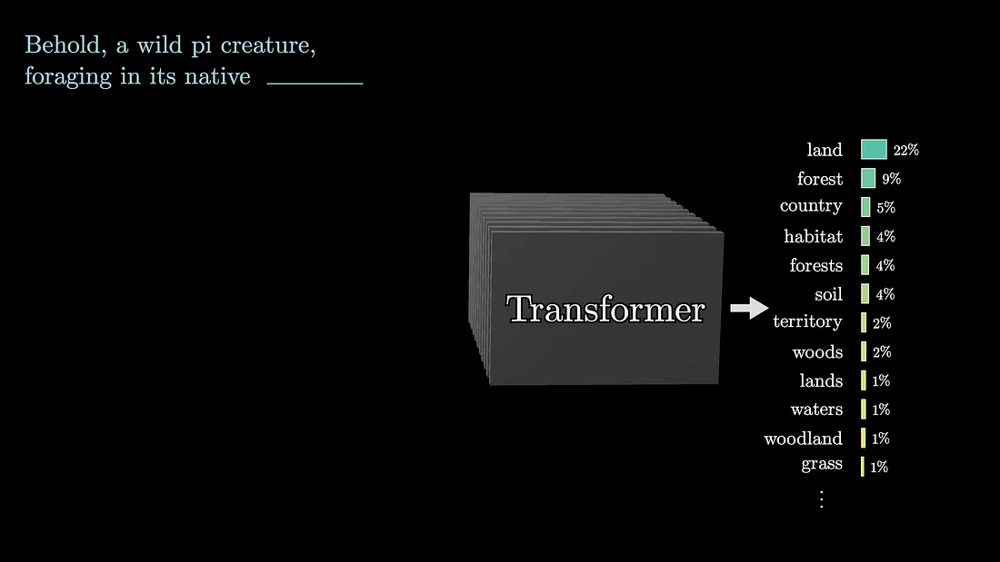
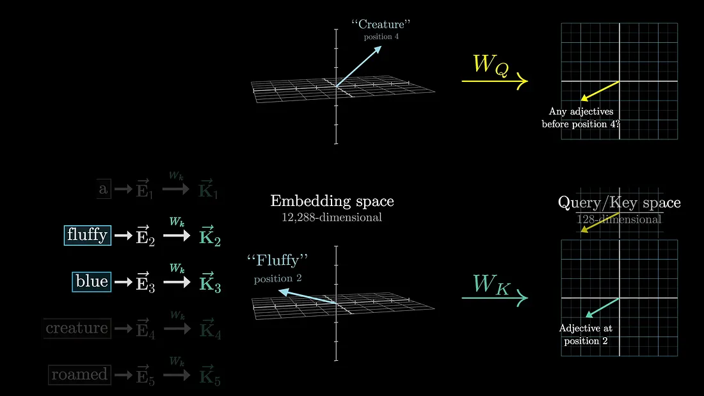
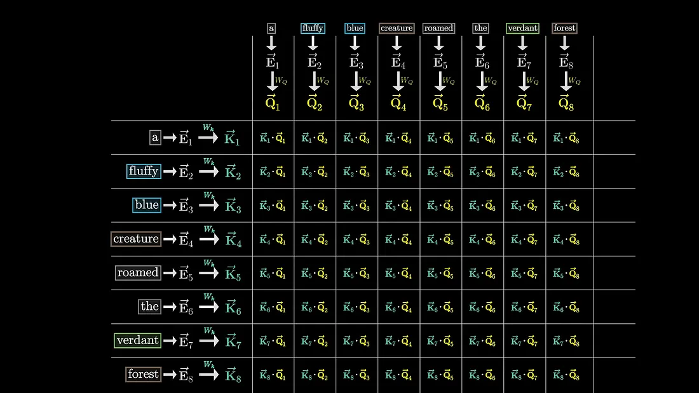
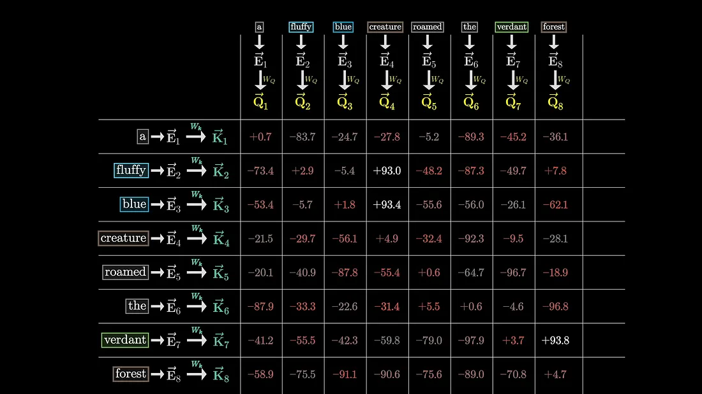
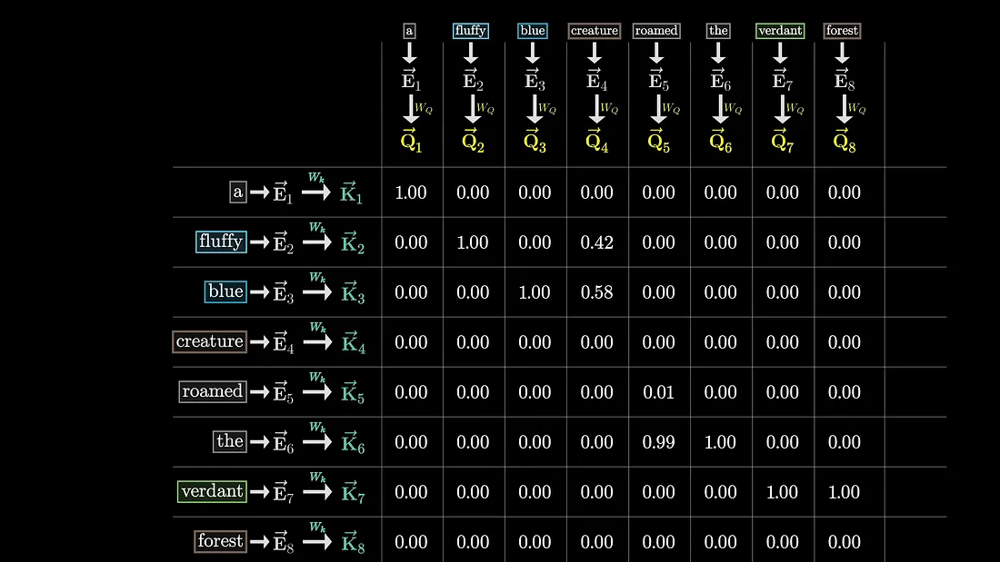
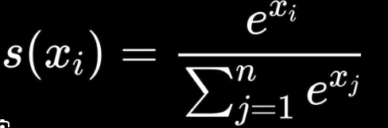
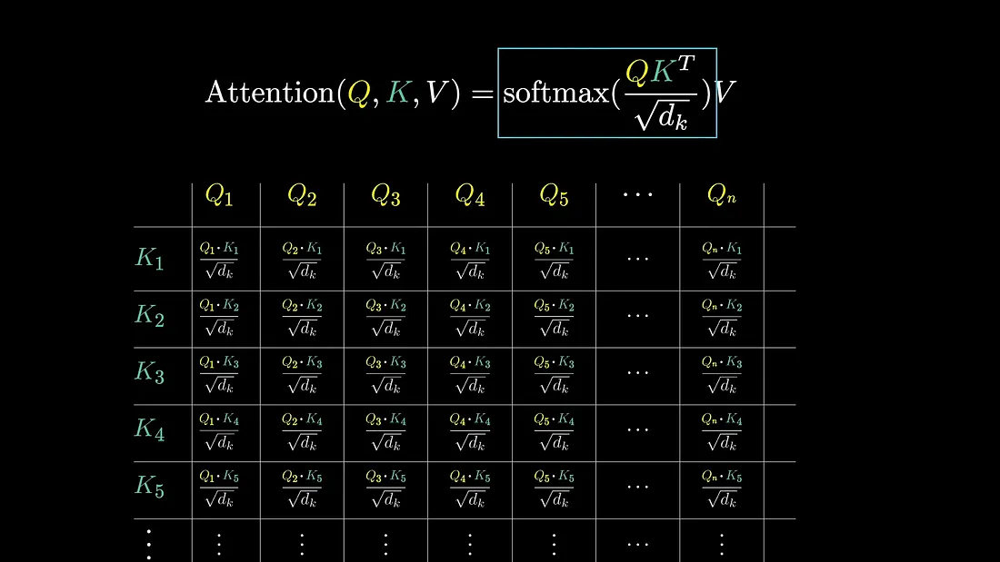
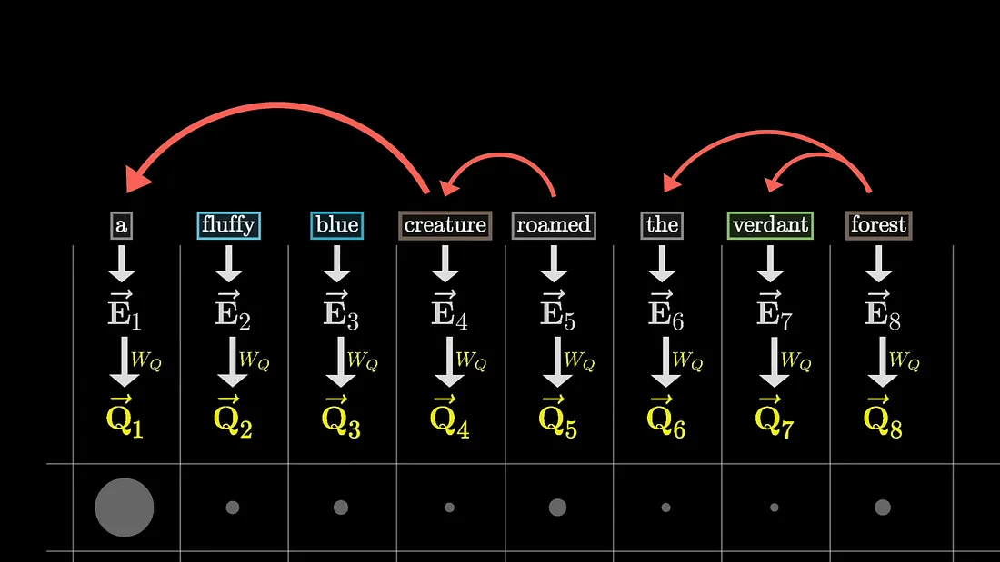
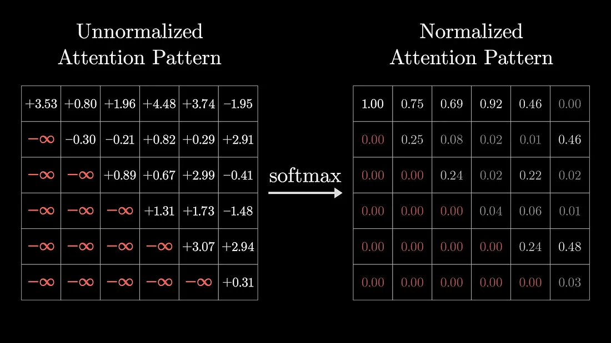

## Attention in Transformers

# Why We Need the Transformer in Deep Learning

Before Transformers, the dominant models for sequential data (like text, audio, DNA, time series) were **RNNs** (Recurrent Neural Networks) and their stronger variants like **LSTMs** and **GRUs**. The[...]

## 🚨 Limitations of RNNs/LSTMs
1. **Poor handling of long-term dependencies**  
   - RNNs struggle to remember information far back in a sequence (like the start of a long paragraph).  
   - Even LSTMs, which improved memory, had practical limits.

2. **Sequential bottleneck**  
   - RNNs and LSTMs process one token at a time, making training slow and less parallelizable.  

3. **Difficulty in capturing context**  
   - RNNs focus more on nearby tokens and can "forget" or distort the importance of words far apart.

---

## 💡 What the Transformer Brings

The **Transformer**, introduced in *"Attention Is All You Need"* (Vaswani et al., 2017), solved these problems with a new idea: **attention**.

- **Self-Attention**  
  Instead of moving step by step, Transformers look at *all tokens in parallel*. Each word can "attend" to every other word directly, no matter how far apart.  
  Example: In *"The cat that the dog chased was black"*, the model can directly connect *"cat"* with *"was black"*.

- **Parallelization**  
  Since Transformers don’t rely on sequential recurrence, we can process all words at once → **much faster training** on GPUs/TPUs.

- **Scalability**  
  Transformers scale extremely well with more data and parameters. This is why models like GPT, BERT, and LLaMA can be trained with billions of parameters.

- **Versatility**  
  They’re not just for text. The same architecture powers **vision transformers (ViT)**, **protein folding (AlphaFold)**, **speech recognition**, and even **reinforcement learning**.

---

In language modeling, causal transformers like GPT predict the next word. In other tasks (like translation), the transformer can generate entire sequences conditioned on input.

Tokens, which are the text units chosen by the tokenizer (e.g., words, subwords, or characters), are associated with high-dimensional embeddings.

These embeddings capture semantic meaning in a high-dimensional space.

The attention mechanism helps adjust these embeddings to encode richer contextual meanings of tokens within the input sequence.

Before diving deep into computational details of the transformer, it's important to consider an example that demonstrates the desired behavior of attention.

For example, the word 'mole' in each sentence in the diagram above has different meanings in different contexts, but in the initial step of a transformer, the vector embedding associated with the token[...]

In order for the model to accurately predict the next word, the final vector in the sequence needs to be updated by all of the attention blocks to represent the relevant information from the full cont[...]

## The Attention Block
In deep learning, word embeddings are used to represent words and their positions in a context. The goal in attention mechanism is to refine the meaning of these embeddings by incorporating meaning fr[...]
This is done by computing a query vector for each word, which is obtained by multiplying a learned query matrix with the embeddings of each word.

Similarly, a key matrix is multiplied with the embeddings to obtain key vectors. The dot product between the keys and queries measures their alignment, indicating which embeddings attend to each other[...]

The embeddings of fluffy and blue would attend to the embedding of creature in our example. This process involves tuning a large number of parameters to minimize the cost function.

The magnitude of relationships among tokens with each other is also seen.

## Deep Dive
In the transformer model, we use a grid of values to represent the relevance between words. In the previous diagram we obtained the magnitude of relationships among tokens, but to capture how much att[...]

The normalization function we use is the softmax function.

This function returns a probability distribution of attention scores.

The variables Q and K represent the query and key vectors, and the numerator represents the dot product between the keys and queries. We then divide the values by the square root of the dimension for [...]
During training, the model predicts every possible token for efficiency.

In order to prevent later words from influencing earlier words, we need to ensure that certain spots in the attention pattern are forced to be zero. However, setting them equal to zero would disrupt t[...]

